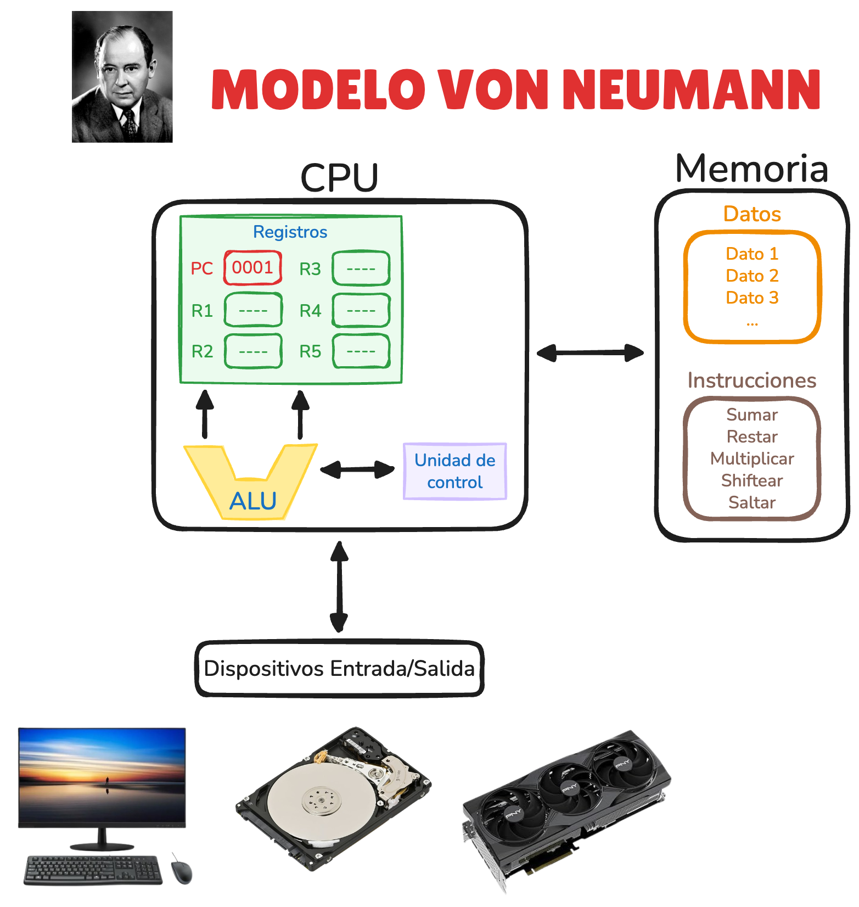
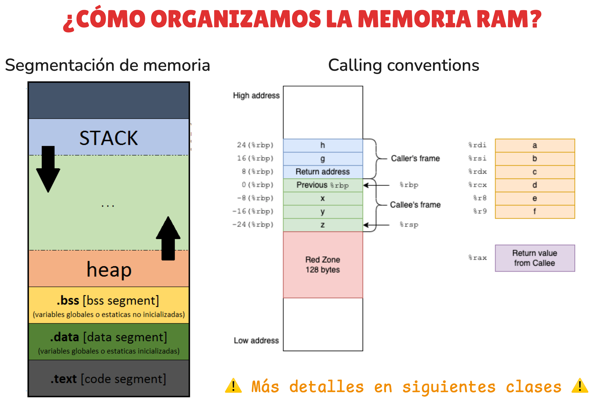
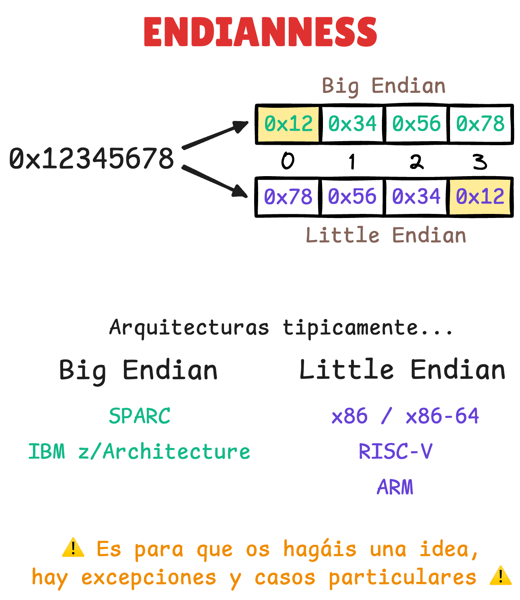

# 🧑‍🏫 Assembly, Von Neumann y Endianness

<!-- CHANNEL -->
[](https://www.youtube.com/@drovoh4k)

<!-- VIDEO META -->
[]()
[]()


## 📄 Resumen

**📺 Clase:** [YouTube: Qué es Assembly, Modelo Von Neumann y Endianness | Curso Reversing #3](https://youtu.be/dd5_Q4qnBaY?list=PLKYfwBIKMkXfVvUFICiRm-qYUkprfUAL0)

En esta clase construimos la base mínima para que cuando empieces a desensamblar no sientas que estás leyendo "jeroglíficos": entenderás qué es Assembly, por qué cada CPU tiene el suyo, el modelo mental Von Neumann (CPU/RAM) y, por último, el famoso endianness (little vs big endian) con una demo práctica.


## 📦 Recursos

### Enlaces

1. **Documentación técnica**
	- [Intel® 64 and IA-32 Architectures Software Developer Manuals](https://www.intel.com/content/www/us/en/developer/articles/technical/intel-sdm.html)
	- [AVR® Instruction Set Manual](https://ww1.microchip.com/downloads/en/devicedoc/AVR-Instruction-Set-Manual-DS40002198A.pdf)
	- [V850ES/SJ3 User's Manual](https://www.renesas.com/en/products/v850es-sj3)

2. **De apoyo**
	- [CPU Simulator](https://cpuvisualsimulator.github.io)
	- [Stack Overflow: Are instruction set and assembly language the same thing?](https://stackoverflow.com/questions/5382130/are-instruction-set-and-assembly-language-the-same-thing)
    - [GeeksForGeeks: What is Endianness? Big-Endian & Little-Endian](https://www.geeksforgeeks.org/dsa/little-and-big-endian-mystery)

3. **Para profundizar**
	- [Compiling a C Program: Behind the Scenes](https://www.geeksforgeeks.org/c/compiling-a-c-program-behind-the-scenes)


### Documentos

- [diagrama_clase.EXCALIDRAW](resources/diagrama_clase.excalidraw) y [imagenes relacionadas](resources)
	<p align="center">
		
		
		
	</p>

### Scripts

- Script para demo de ISA (`demo_isa.c`)
	- Código
		```c
		#include <stdint.h>

		__attribute__((noinline))
		uint32_t add32(uint32_t a, uint32_t b) {
			return a + b;
		}
		```
	- Compilación
		```sh
		gcc -m64 -O2 -S -masm=intel demo_isa.c -o demo_x86_64.s
		```
		```sh
		avr-gcc -mmcu=atmega328p -Os -S demo_isa.c -o demo_avr.s
		```

- Script para demo endianness (`demo_endian.c`)
	- Código
		```c
		#include <stdio.h>
		#include <stdint.h>
		
		int main() {
			uint32_t x = 0x12345678;
			unsigned char *p = (unsigned char*)&x;
		
			for (int i = 0; i < 4; i++) {
				printf("%02x ", p[i]);
			}
			puts("");
			return 0;
		}
		```

	- Compilación
		```sh
		gcc -O0 demo_endian.c -o demo_endian
		```