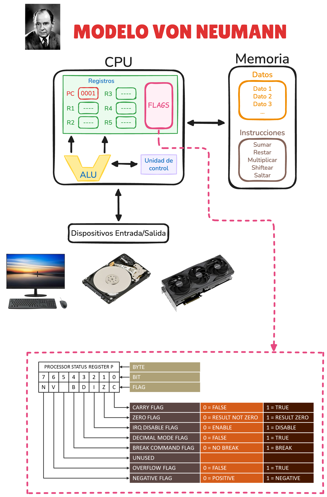
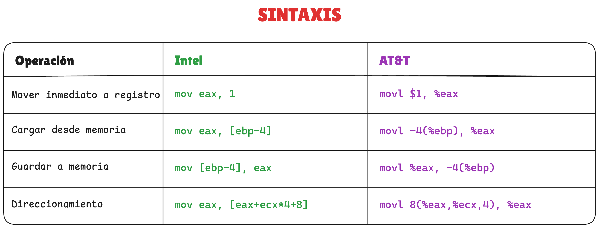
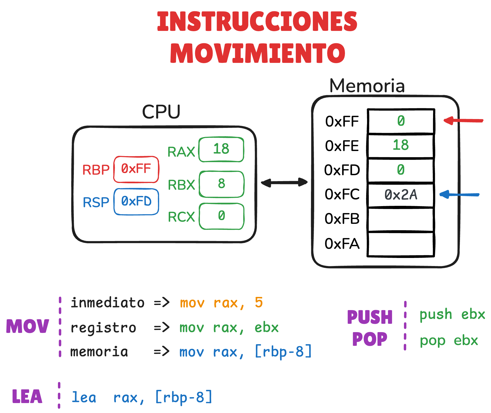
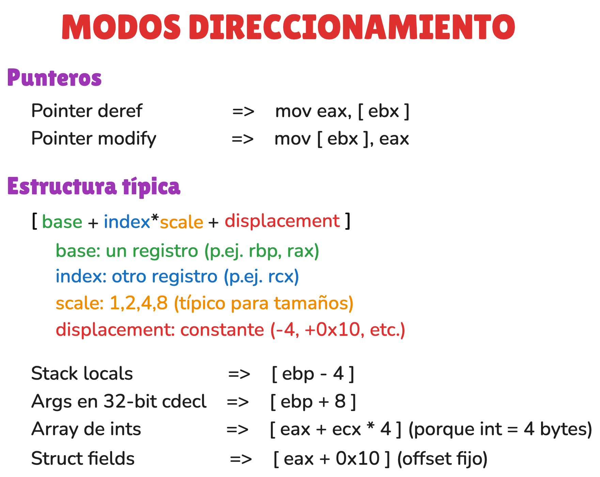
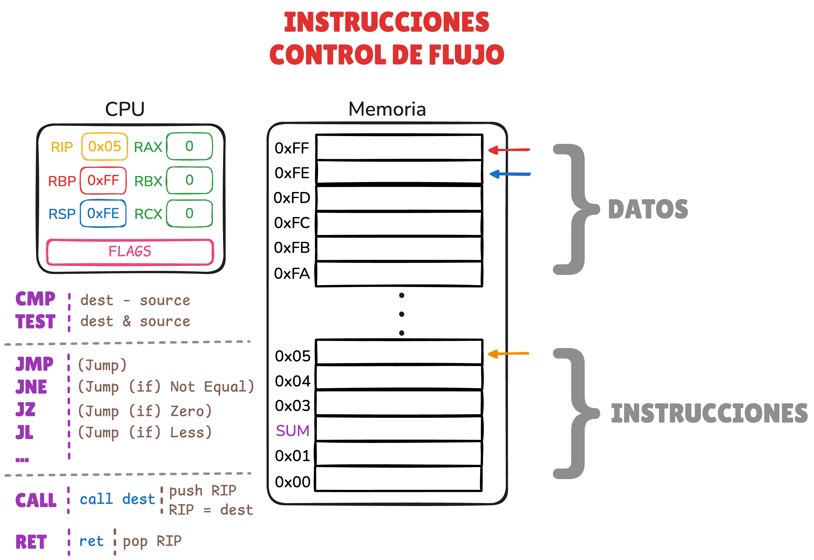
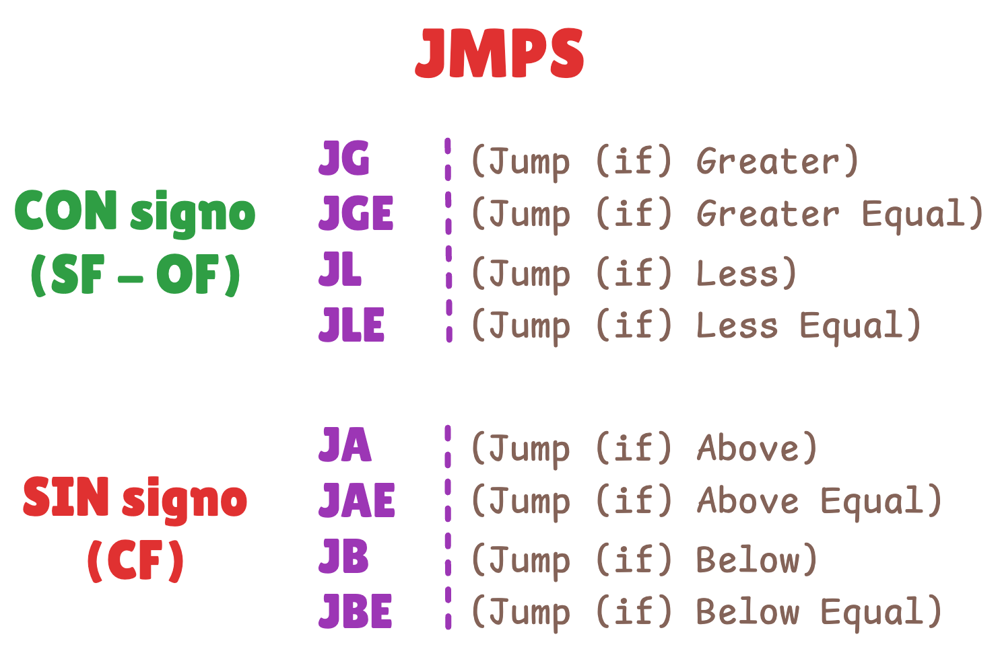

# 🧑‍🏫 Instrucciones Assembly

<!-- CHANNEL -->
[](https://www.youtube.com/@drovoh4k)

<!-- VIDEO META -->
[]()
[]()


## 📄 Resumen

**📺 Clase:** [YouTube: Assembly: Solo necesitas estas 3 Categorías
| Curso Reversing #4](https://youtu.be/v1PtzvvOeDg?list=PLKYfwBIKMkXfVvUFICiRm-qYUkprfUAL0)

En esta clase desglosamos el assembly en 3 simples categorías, vemos las instrucciones más comunes y te doy un método para poder entender cualquier instrucción nueva que te encuentres en un binario sin volverte loco.


## 📦 Recursos

### Enlaces

1. **Documentación técnica**
	- [FelixCloutier: x86 and amd64 instruction reference](https://www.felixcloutier.com/x86)
		- Referencia rápida para consultar instrucciones assembly.
		- Aunque para la resolución de los challenges de este repositorio es más que suficiente, es solo para tener una referencia.
		- Para cualquier proyecto serio, consultar documentación oficial como, por ejemplo, el [Intel® 64 and IA-32 Architectures Software Developer Manuals](https://www.intel.com/content/www/us/en/developer/articles/technical/intel-sdm.html).

	- Instrucciones de movimiento
		- [`MOV`](https://www.felixcloutier.com/x86/mov)
			- Copia un valor desde un origen a un destino (registro, memoria o inmediato).
		- [`LEA`](https://www.felixcloutier.com/x86/lea)
			- Calcula una dirección efectiva y la guarda en un registro (no accede a memoria).
			---
		- [`PUSH`](https://www.felixcloutier.com/x86/push)
			- Guarda (empuja) un valor en la pila y actualiza `rsp`.
		- [`POP`](https://www.felixcloutier.com/x86/pop)
			- Restaura (saca) un valor de la pila y actualiza `rsp`.

	- Instrucciones aritméticas / lógica
		- [`ADD`](https://www.felixcloutier.com/x86/add)
			- Suma el origen al destino (`dest = dest + src`)
		- [`SUB`](https://www.felixcloutier.com/x86/sub)
			- Resta el origen al destino (`dest = dest - src`)
			---
		- [`XOR`](https://www.felixcloutier.com/x86/xor)
			- XOR bit a bit (`dest = dest XOR src`)
		- [`AND`](https://www.felixcloutier.com/x86/and)
			- AND bit a bit (`dest = dest AND src`)
		- [`OR`](https://www.felixcloutier.com/x86/or)
			- OR bit a bit (`dest = dest OR src`)
			---
		- [`INC`](https://www.felixcloutier.com/x86/inc)
			- Incrementa en 1 (`dest = dest + 1`)
		- [`DEC`](https://www.felixcloutier.com/x86/dec)
			- Decrementa en 1 (`dest = dest - 1`)

	- Instrucciones sobre control de flujo
		- [`CMP`](https://www.felixcloutier.com/x86/cmp)
			- Compara dos operandos actualizando flags (como si hiciera una resta, pero sin guardar el resultado)
		- [`TEST`](https://www.felixcloutier.com/x86/test)
			- AND lógico para flags (no guarda el resultado), típico para comprobar cero
			---
		- [`JMP`](https://www.felixcloutier.com/x86/jmp)
			- Salto incondicional (siempre salta)
		- [`JCC`](https://www.felixcloutier.com/x86/jcc)
			- `JNE` (jump if not equal)
				- Salta si la comparación anterior determinó "no iguales" (ZF=0)
			- `JZ` (jump if zero / equal)
				- Salta si el resultado anterior fue cero (ZF=1)
			- `JL` (jump if less, signed)
				- Salta si el primer operando era “menor que” el segundo en comparación con signo
			- `...`
			---
		- [`CALL`](https://www.felixcloutier.com/x86/call)
			- Llama a una función: guarda la dirección de retorno y salta a la función.
		- [`RET`](https://www.felixcloutier.com/x86/ret)
			- Vuelve de una función: restaura la dirección de retorno desde la pila y salta allí.


2. **De apoyo**
	- [Medium: Intel vs AT&T Syntax](https://medium.com/@irfanbhat3/intel-vs-at-t-syntax-426fb7a78c96)
		- Artículo donde se comparan ambas sintaxis mediante ejemplos.

	-  [C64 Wiki: Processor Status Register](https://www.c64-wiki.com/wiki/Processor_Status_Register)
		- Artículo donde se explica en el registro que almacena los flags.

	- [Luis Llamas: Qué es signed y unsigned en el sistema binario](https://www.luisllamas.es/que-es-signed-unsigned-en-binario)
		- Artículo donde se explica el sistema signed y unsigned

### Documentos

- [diagrama_clase.EXCALIDRAW](resources/diagrama_clase.excalidraw) y [imagenes relacionadas](resources)
	<p align="center">
		
	</p>

	<p align="center">
		
	</p>

	<p align="center">
		
		
	</p>

	<p align="center">
		
	</p>

	<p align="center">
		
		
		
	</p>

### Snippets
- Configurar secciones contexto PwnDbg
	```
	set context-sections regs disasm stack
	```

### Demos

- Demo sobre instrucciones de movimiento
	- Código
		- [demos/demo_instr_movimiento.s](demos/demo_instr_movimiento.s)
	- Compilación
		```sh
		gcc -g -O0 -fno-omit-frame-pointer -no-pie demo_instr_movimiento.s -o demo_instr_movimiento
		```

- Demo sobre instrucciones aritméticas / lógicas
	- Código
		- [demos/demo_instr_arith_logic.s](demos/demo_instr_arith_logic.s)
	- Compilación
		```sh
		gcc -g -O0 -fno-omit-frame-pointer -no-pie demo_instr_arith_logic.s -o demo_instr_arith_logic
		```

- Demo sobre instrucciones de control de flujo
	- Código
		- [demos/demo_instr_control_flow.s](demos/demo_instr_control_flow.s)
	- Compilación
		```sh
		gcc -g -O0 -fno-omit-frame-pointer -no-pie demo_instr_control_flow.s -o demo_instr_control_flow
		```