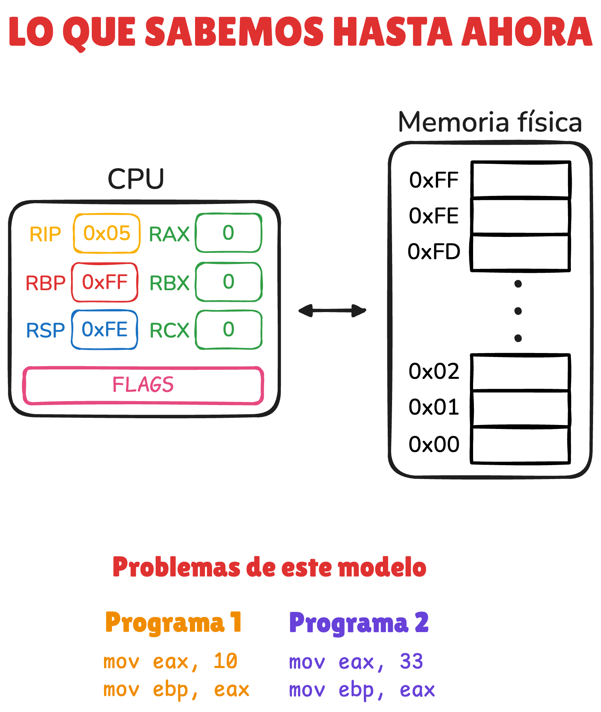
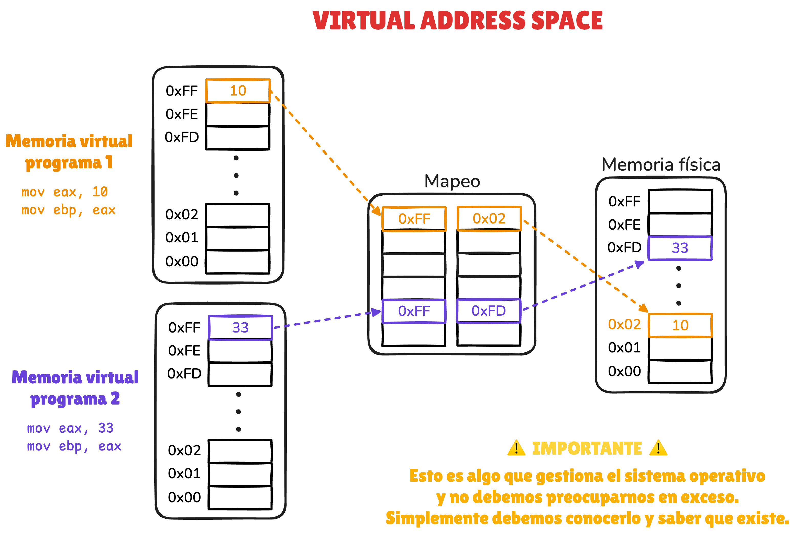
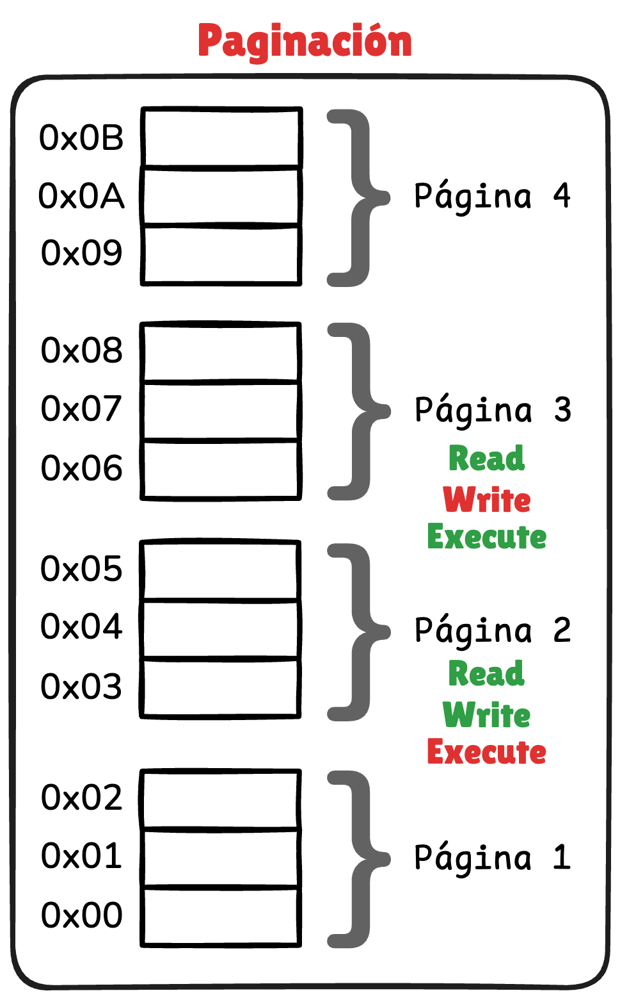
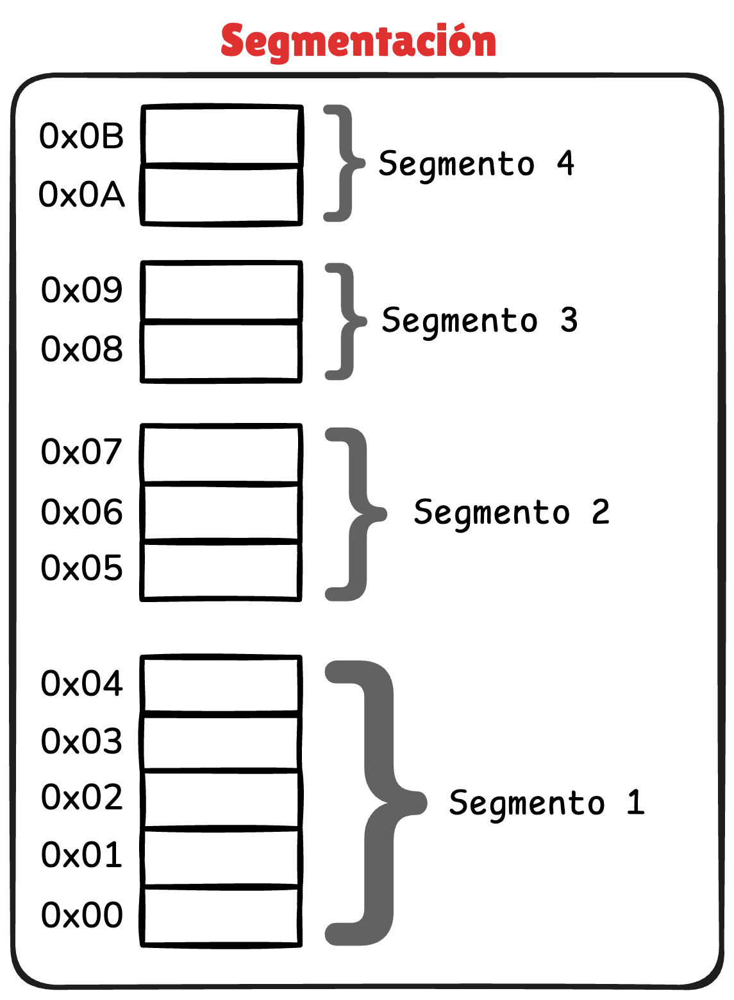
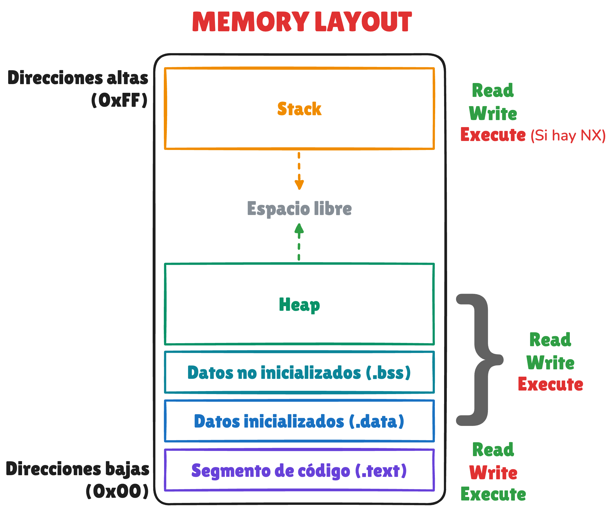
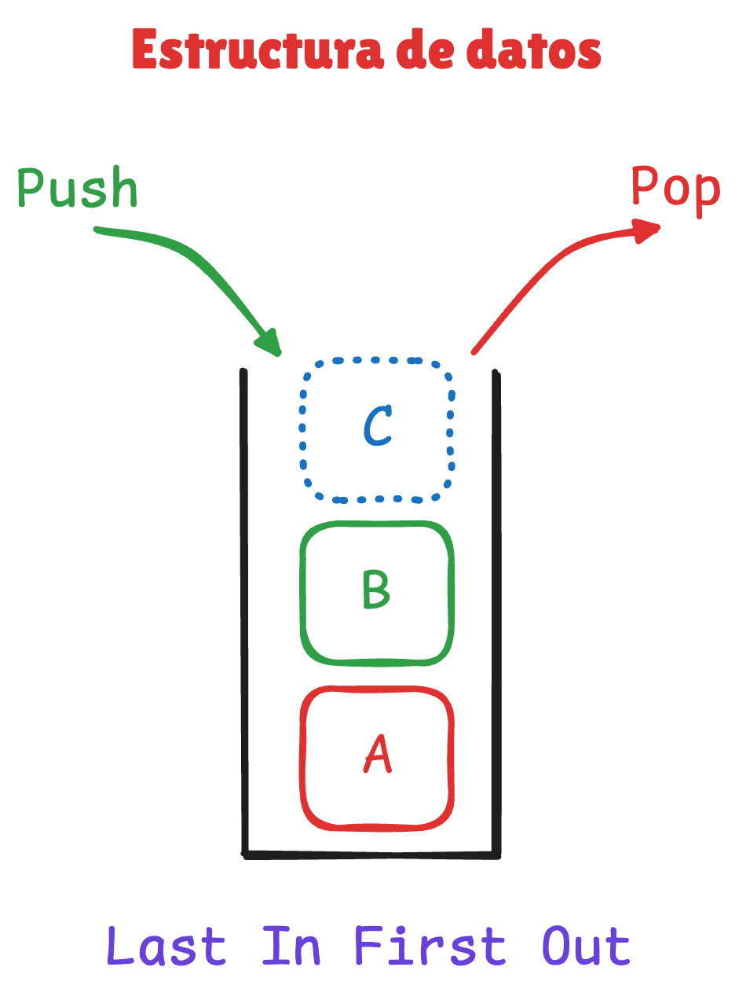
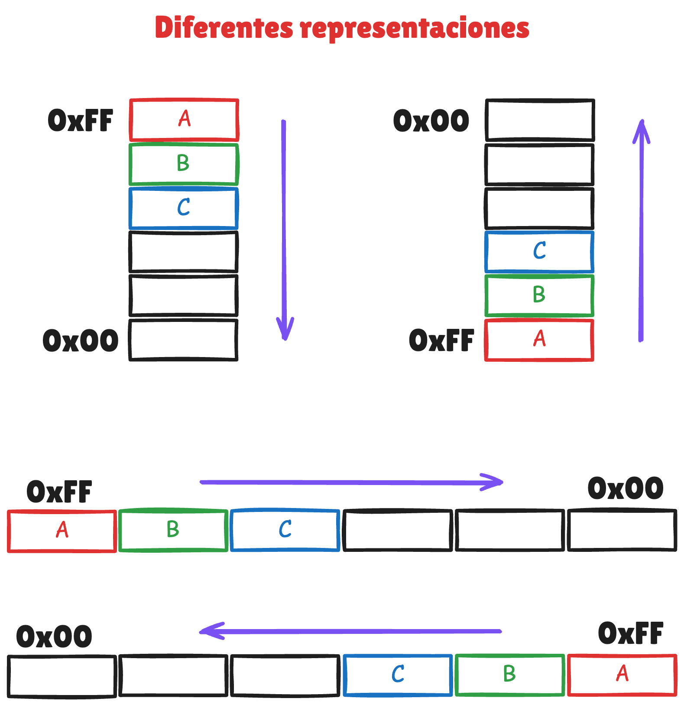
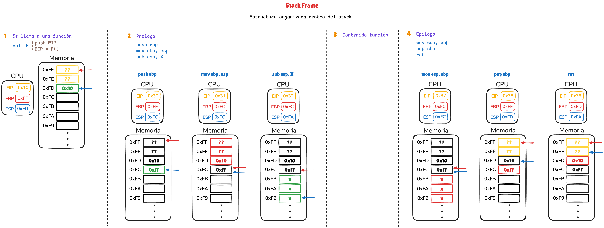
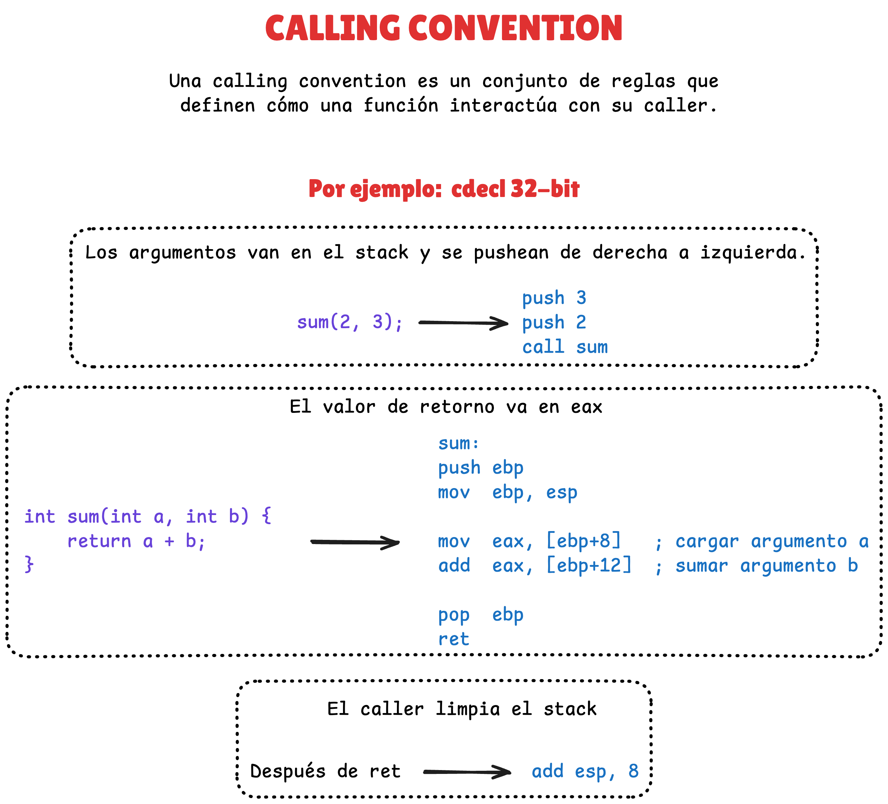

<!-- drovoleaks-banner:start -->
<a href="https://drovoleaks.re/">
  <picture>
    <source media="(max-width: 768px)" srcset="https://raw.githubusercontent.com/drovoh4k/DrovoLeaks/main/.github/banner-archivado-movil.svg">
    
  </picture>
</a>
<!-- drovoleaks-banner:end -->

# 🧑‍🏫 Memoria y Stack

<!-- CHANNEL -->
[](https://www.youtube.com/@drovoh4k)
[](https://discord.gg/kFrpheJkdN)

<!-- VIDEO META -->
[]()
[]()


## 📄 Resumen

**📺 Clase:** https://youtu.be/ymEry_MtvqY?list=PLKYfwBIKMkXfVvUFICiRm-qYUkprfUAL0

En esta clase exploramos cómo funciona realmente la memoria de un proceso, revisando la memoria virtual, el memory layout y el funcionamiento del stack, incluyendo stack frames y calling conventions (cdecl) para entender cómo se organizan las funciones.


## 📦 Recursos

### Enlaces

1. **Virtual Memory vs Physical Memory**
	- [GeeksForGeeks: Virtual Memory in Operating System](https://www.geeksforgeeks.org/operating-systems/virtual-memory-in-operating-system)
		- Explica qué es la memoria virtual y cómo el sistema operativo crea un espacio de direcciones independiente para cada proceso.
		- Ayuda a entender por qué las direcciones que vemos en reversing no corresponden directamente con la RAM física.
	- [OsDev: Paging](https://wiki.osdev.org/Paging)
		- Describe el mecanismo de paginación que permite traducir direcciones virtuales a direcciones físicas mediante páginas de memoria.
		- Es útil para entender cómo el hardware y el sistema operativo implementan la memoria virtual.
	- [OsDev: Page Tables](https://wiki.osdev.org/Page_Tables)
		- Explica cómo funcionan las tablas de páginas, las estructuras que almacenan el mapeo entre memoria virtual y memoria física.
		- También muestra cómo se gestionan permisos de memoria y aislamiento entre procesos.
	- [GeeksForGeeks: Segmentation](https://www.geeksforgeeks.org/operating-systems/segmentation-in-operating-system)
		- Introduce el modelo de segmentación de memoria usado históricamente en arquitecturas x86.
		- Ayuda a comprender cómo se dividía la memoria en regiones lógicas antes del uso generalizado de la paginación.

2. **Memory Layout**
	- [GeeksForGeeks: Memory Layout of C Programs](https://www.geeksforgeeks.org/c/memory-layout-of-c-program)
		- Describe cómo se organiza la memoria de un programa en ejecución en secciones como `.text`, `.data`, `.bss`, heap y stack.
		- Este modelo ayuda a visualizar dónde viven el código, las variables y las estructuras dinámicas durante la ejecución.

3. **El stack**
	- [GeeksForGeeks: Stack Data Structure](https://www.geeksforgeeks.org/dsa/stack-data-structure)
		- Explica la estructura de datos stack y el modelo LIFO (Last In First Out). 
		- Este concepto es la base para entender cómo funciona el stack de un programa a nivel de ejecución.
	- [GeeksForGeeks: Stack Frame in Computer Organization](https://www.geeksforgeeks.org/computer-organization-architecture/stack-frame-in-computer-organization)
		- Describe qué es un stack frame y cómo cada llamada a función crea su propia estructura dentro del stack.
		- Esto permite organizar variables locales, direcciones de retorno y el estado de ejecución.

4. **Calling convention**
	- [GeekForGeek: Calling Conventions in C/C++](https://www.geeksforgeeks.org/cpp/calling-conventions-in-c-cpp)
		- Explica las reglas que definen cómo se pasan argumentos, cómo se devuelve un valor y cómo se gestiona el stack durante una llamada a función.
		- Estas convenciones permiten que funciones compiladas por distintos módulos o compiladores puedan interactuar correctamente.

### Documentos

- [diagrama_clase.EXCALIDRAW](resources/diagrama_clase.excalidraw) y [imagenes relacionadas](resources)
    <p align="center">
        
    </p>

    <p align="center">
        
    </p>

    <p align="center">
        
        
    </p>

    <p align="center">
        
    </p>

    <p align="center">
        
        
    </p>

    <p align="center">
        
    </p>

    <p align="center">
        
    </p>

### Demos

- Demo sobre memoria y stack
    - Código
        - [demos/demo.c](demos/demo.c)
    - Compilación
        ```sh
        gcc -m32 -fno-pie -no-pie -O0 demo.c -o demo
        ```