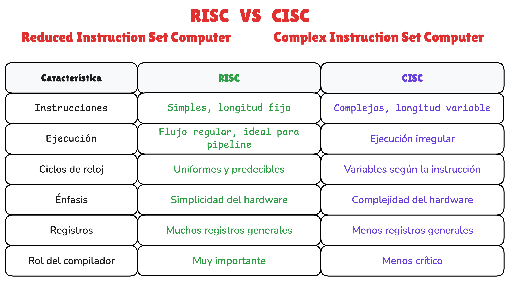
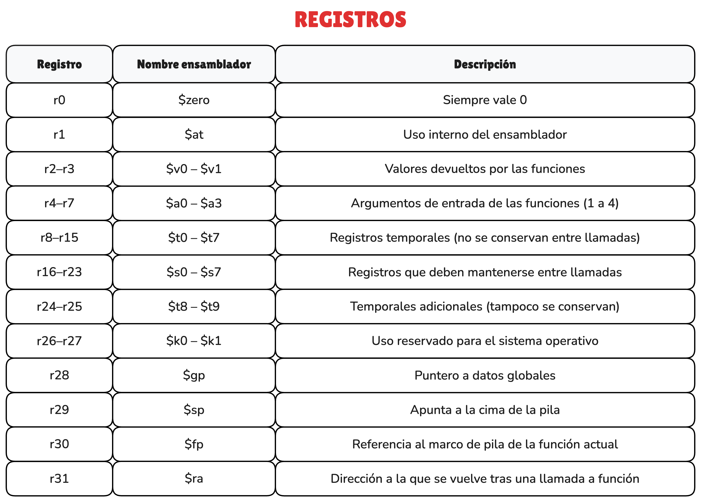
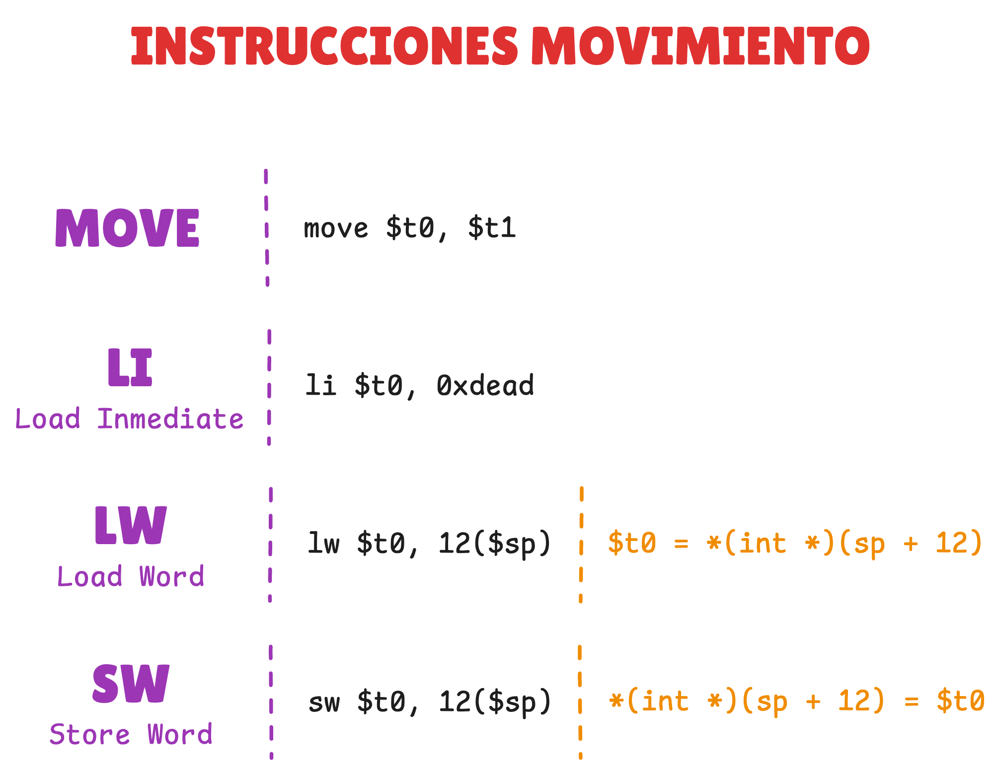
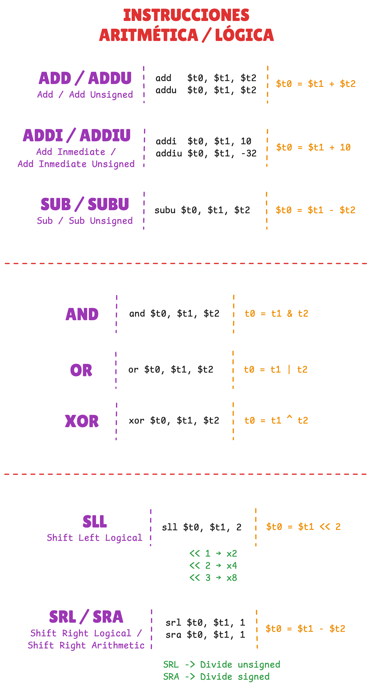
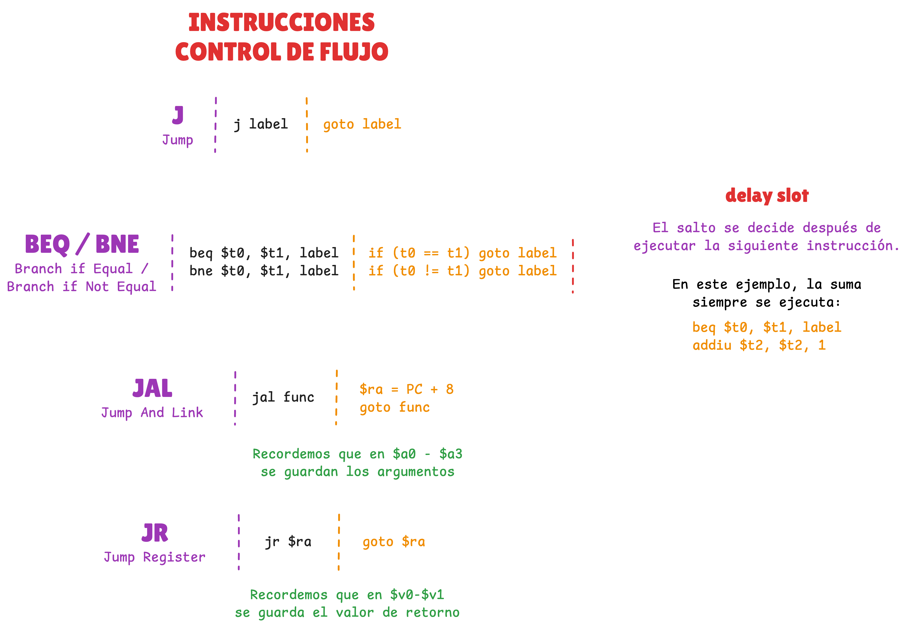
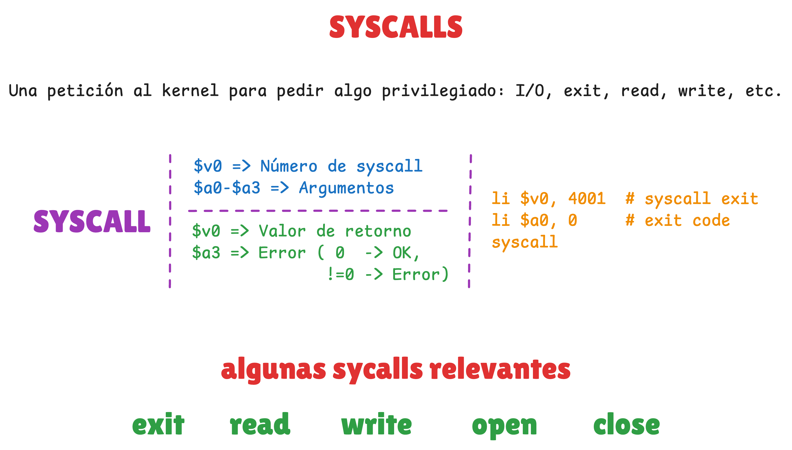

# 🧑‍🏫 Introducción a MIPS

<!-- CHANNEL -->
[](https://www.youtube.com/@drovoh4k)

<!-- VIDEO META -->
[]()
[]()


## 📄 Resumen

**📺 Masterclass:** https://youtu.be/o9_JzxD1X1o

Esta clase es una base sólida de MIPS orientada a reversing. Parte del contexto: muchos dispositivos IoT, routers y firmwares usan esta arquitectura, así que si analizas binarios embebidos acabarás enfrentándote a ella.

Primero se explica su filosofía RISC: simplicidad, instrucciones de longitud fija y diseño pensado para eficiencia y pipeline. Se cubre la arquitectura básica (segmento de datos y de código) y el modelo de registros, clave para entender funciones reales.

Después se monta el entorno práctico: compilar (big/little endian), ejecutar con QEMU y debuggear con GDB. La idea es tener laboratorio propio.

Por último, se estudian las instrucciones esenciales: movimiento, aritmética y lógica, saltos (incluyendo delay slot) y syscalls.


## 📦 Recursos

### Enlaces
1. **Documentación técnica**
    - [MIPS32 Architecture For Programmers Volume II: The MIPS32 Instruction Set](https://www.cs.cornell.edu/courses/cs3410/2008fa/MIPS_Vol2.pdf)
        - Documentación oficial para consultar las instrucciones assembly de la arquitectura MIPS.

    - [W3challs: Syscalls MIPS o32](https://syscalls.w3challs.com/?arch=mips_o32)
        - Referencia rápida para consultar las llamadas de sistema.

2. **De apoyo**
    - [Training basic MIPS: Instruction Set](https://training.mips.com/basic_mips/PDF/Instruction_Set.pdf)
        - Documento de formación básica de MIPS donde habla del instruction set.

### Documentos
- [CheatSheet Instruction Set MIPS32](resources/documentos/CheatSheet_InstructionSet_MIPS32.pdf)
    - Documento resumen con la mayoría de instrucciones clasificadas por categorías e información extra útil.

- [diagrama_clase.EXCALIDRAW](resources/material_clase/diagrama_clase.excalidraw) y [imagenes relacionadas](resources/material_clase/imgs)

    <p align="center">
        
    </p>

    <p align="center">
        
    </p>

    <p align="center">
        
    </p>

    <p align="center">
        
    </p>

    <p align="center">
        
    </p>

    <p align="center">
        
    </p>

    <p align="center">
        
    </p>


### Snippets
- Instalar herramientas compilación / ejecucción / debug
    ```
    sudo apt install gcc-mips-linux-gnu gcc-mipsel-linux-gnu
    sudo apt install qemu-system-mips qemu-user-static
    sudo apt install gdb-multiarch
    ```

- Compilar y ejecutar manualmente
    - Big endiann
        ```
        mips-linux-gnu-as demo.s -o demo.o
        mips-linux-gnu-ld demo.o -o demo
        ```
        ```
        chmod +x demo
        qemu-mips ./demo
        ```
    - Little endiann
        ```
        mipsel-linux-gnu-as demo.s -o demo.o
        mipsel-linux-gnu-ld demo.o -o demo
        ```
        ```
        chmod +x demo
        qemu-mipsel ./demo
        ```

- Debugear binario
    ```
    qemu-mips -g 1234 ./demo
    ```
    ```
    pwndbg demo
    set show-compact-regs on
    target remote :1234
    ```


### Demos
- Makefile para compilación
    - [demos/Makefile](resources/demos/Makefile)

- Demo inicial para aprender a compilar y ejecutar
    - [demos/hello_world.s](resources/demos/hello_world.s)

- Demos sobre categorías de instrucciones
    - [demos/movement.s](resources/demos/movement.s)
    - [demos/arith.s](resources/demos/arith.s)
    - [demos/flow.s](resources/demos/flow.s)
    - [demos/syscalls.s](resources/demos/syscalls.s)