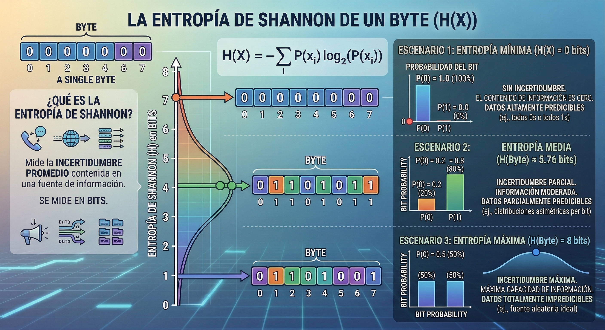

<!-- drovoleaks-banner:start -->
<a href="https://drovoleaks.re/">
  <picture>
    <source media="(max-width: 768px)" srcset="https://raw.githubusercontent.com/drovoh4k/DrovoLeaks/main/.github/banner-archivado-movil.svg">
    
  </picture>
</a>
<!-- drovoleaks-banner:end -->

# Snake

[](https://www.youtube.com/@drovoh4k)
[](https://discord.gg/kFrpheJkdN)

[]()
[]()

[]()
[]()

[]()
[]()
[]()

| Links | |
|---|---|
| 🧩 Source | https://crackmes.one/crackme/64f1f7afd931496abf909525 |
| 🪞 Mirror | [challenge/snake.zip](challenge/snake.zip) - Password: `crackmes.one` |
| 🎥 WriteUp | https://youtu.be/U5wPKmfl6TM |


## 📦 Recursos

### Enlaces

1. **Documentación técnica**
    - [FelixCloutier: x86 and amd64 instruction reference](https://www.felixcloutier.com/x86)
        - Referencia rápida para consultar instrucciones assembly.
        - Aunque para la resolución de los challenges de este repositorio es más que suficiente, es solo para tener una referencia.
        - Para cualquier proyecto serio, consultar documentación oficial como, por ejemplo, el [Intel® 64 and IA-32 Architectures Software Developer Manuals](https://www.intel.com/content/www/us/en/developer/articles/technical/intel-sdm.html).

    - [Libreria de Pycryptodome - Chacha20](https://pycryptodome.readthedocs.io/en/latest/src/cipher/chacha20.html)
        - Documentación oficial de la libreria Chacha20.
        - Permite utilizar este cifrado simétrico en Python para proteger datos mediante operaciones de cifrado y descifrado, gestionando claves, nonces y flujo de bytes de forma sencilla.

2. **De apoyo**
    - [UPX: the Ultimate Packer for eXecutables](https://upx.github.io)
        - Web oficial del packer de UPX
        - Permite comprimir ejecutables reduciendo su tamaño y empaquetándolos.

3. **Para profundizar**
    - [Medium: La entropía de Shannon como medida de la incertidumbre y la información potencial. Parte I](https://medium.com/@JuanEnredado/la-entrop%C3%ADa-de-shannon-como-medida-de-la-incertidumbre-parte-i-6a12c4d5d36) y [Parte II](https://medium.com/@JuanEnredado/la-entrop%C3%ADa-de-shannon-como-medida-de-la-incertidumbre-y-la-informaci%C3%B3n-potencial-parte-ii-fc5e32a2b80e)
        - Artículos que explican el concepto de entropía de Shannon dentro de la teoría de la información.
        - Se describe cómo la entropía mide la incertidumbre o cantidad de información presente en un conjunto de datos, un concepto muy utilizado en áreas como criptografía, compresión de datos y análisis de malware.

    - [GitHub Ginurx: chacha20-c](https://github.com/Ginurx/chacha20-c)
        - Repositorio de github de la implementación de chacha20 utilizada en el binario.
 
### Documentos
- Infografia entropia de Shannon

    <p align="center">
        
    </p>


### Snippets
- Creación entorno virtual Python
    ```sh
    python3 -m venv .venv
    source .venv/bin/activate
    ```
    ```
    pip install pycryptodome
    ```


### Scripts

- [`scripts/decrypt.py`](scripts/decrypt.py)
    - Utilizado para automatizar el desencriptado de la flag.